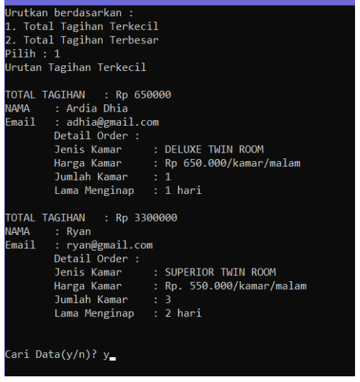
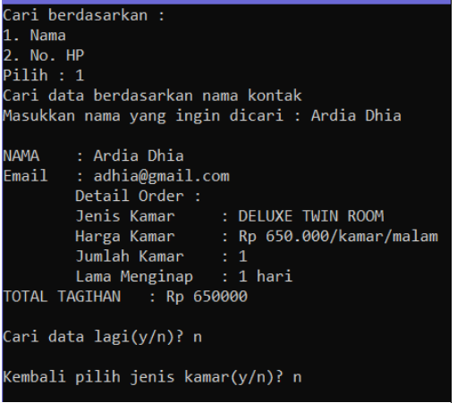

# cpp-hotel-booking

## Tentang Proyek

Proyek sederhana berbasis C++ yang dirancang untuk mensimulasikan sistem pemesanan kamar hotel. Proyek ini mencakup berbagai fungsi utama yang sering digunakan dalam sistem pemesanan hotel seperti pemesanan kamar, riwayat pemesanan, sorting, dan pencarian transaksi.

## Fitur

- **Pemesanan Kamar:** Fitur ini memungkinkan pengguna untuk memesan kamar di hotel. Pengguna dapat memilih tipe kamar, waktu check-in dan check-out, dll.
- **Riwayat Pemesanan:** Menampilkan riwayat pemesanan kamar yang telah dilakukan oleh semua pengguna.
- **Sorting:** Fitur ini memungkinkan pengguna untuk mengurutkan daftar transaksi berdasarkan kriteria tertentu.
- **Searching:** Fitur pencarian memudahkan pengguna untuk mencari transaksi berdasarkan kriteria spesifik.

## Dokumentasi

Berikut adalah beberapa screenshot dari hasil running program:

### Pemesanan Kamar

### Riwayat Pemesanan

### Sorting

### Pencarian

